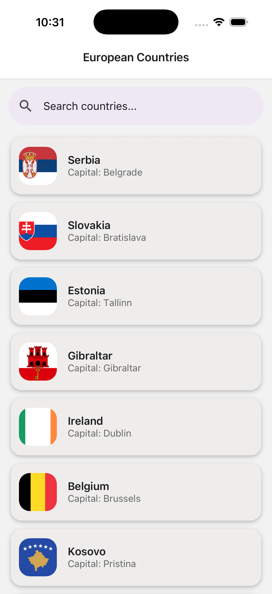
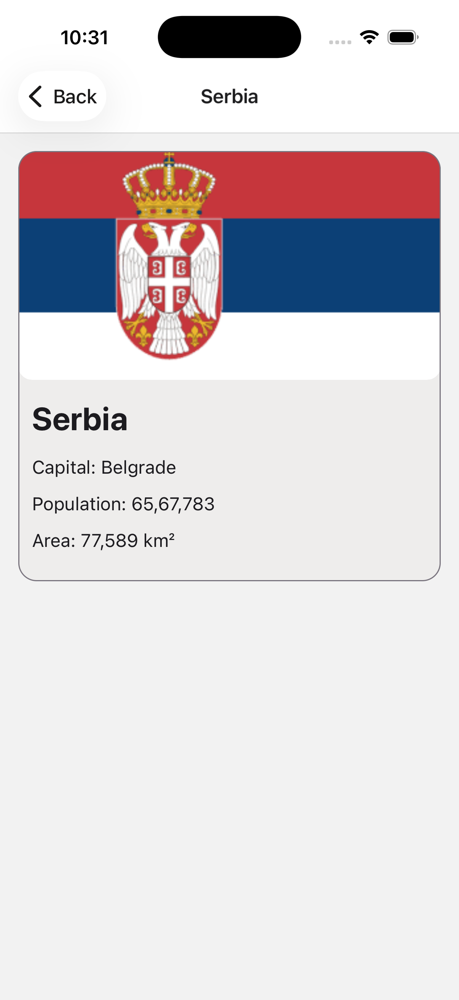
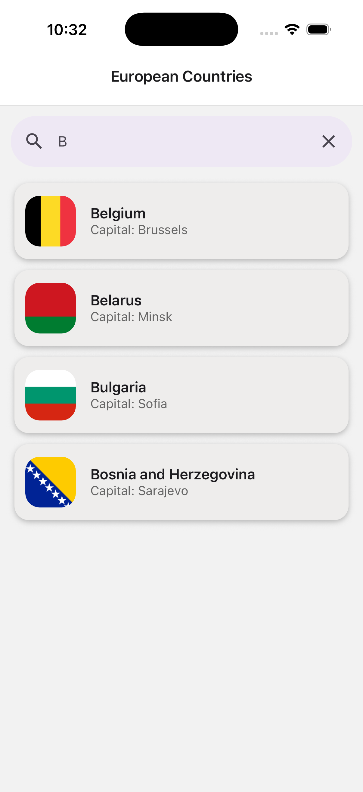

# European Countries Explorer

A React Native app built with Expo that allows users to explore European countries,

## Features

- Fetches country data from the [REST Countries API](https://restcountries.com)
- Displays only European countries in the main list
- Each list item shows:
  - Country flag 
  - Country name 
  - Capital city 
- Tap a country to navigate to a detail screen with:
  - Population
  - Area
- Search/filter functionality for country names (case-insensitive, starts-with)
- Graceful handling of loading and error states
- Clean, maintainable code with custom hooks and modular components
- Basic UI and logic tests, including snapshot tests for all components and screens

## Project Structure

```
/EuropeanCountriesExplorer
├── src/
│   ├── api/                # API calls
│   ├── components/         # Reusable UI components
│   ├── hooks/              # Custom hooks
│   ├── navigation/         # Navigation setup
│   ├── screens/            # App screens (list, detail)
│   ├── types/              # TypeScript types
│   └── __tests__/          # Unit and snapshot tests
├── package.json
├── README.md
└── ...
```

## Getting Started

1. Clone the repository:
   ```sh
   git clone https://github.com/codebyRohiniH/EuropeanCountriesExplorer.git
   cd EuropeanCountriesExplorer
   ```
2. Install dependencies:
   ```sh
   npm install
   # or
   yarn install
   ```
3. Run the app:
   ```sh
   npx expo start
   ```

## Testing

- Run all tests:
  ```sh
  npm test
  # or
  yarn test
  ```
- Snapshot and logic tests are provided for all components, screens, and hooks.


## 📸 Screenshots

### Home Screen


### Country Detail Screen


### Search Feature



## License

MIT
